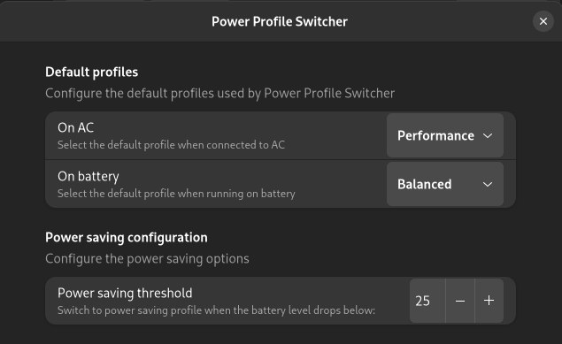

# Power Profile Switcher
GNOME Shell extension to automatically switch between power profiles based on power supply

## Settings
  

When enabled, the extension will automatically switch to:
- the selected defaults profiles based on the which power supply the device is running on.
- to power saving profile if running on battery and the percentage drops below the selected level.

## Installation

### Dependencies
This extension depends on `powerprofilesctl`. Install it with:
```
# Arch
sudo pacman -S power-profiles-daemon

# Ubuntu
sudo apt install power-profiles-daemon

# Fedora
sudo dnf install power-profiles-daemon
```

Then you need to enable and start the systemd service
```
sudo systemctl enable power-profiles-daemon
sudo systemctl start power-profiles-daemon
```

### From Gnome Extensions store
This extension can be found in the [store](https://extensions.gnome.org/extension/5575/power-profile-switcher/).

[](https://extensions.gnome.org/extension/5575/power-profile-switcher/)

### Installation from source
Clone the repo, pack and install the extension.
```
git clone https://github.com/eliapasquali/power-profile-switcher
cd power-profile-switcher
gnome-extensions pack
gnome-extensions install power-profile-switcher@eliapasquali.github.io.shell-extension.zip
```
After this, the extensions is installed. In order to enable it run the following command or use the Extensions app.
```
gnome-extensions enable power-profile-switcher@eliapasquali.github.io
```

## GNOME Version Support
This extensions is developed and tested on Arch, with GNOME 43 on Wayland.

## Contribution
Contribution to this project are welcome
