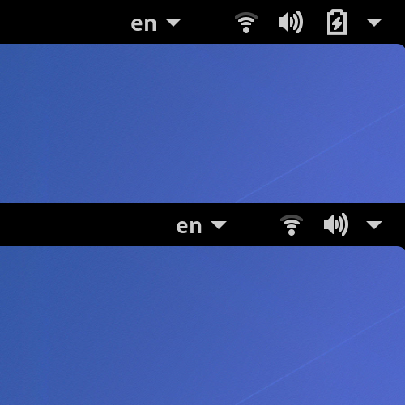

# Autohide Battery

GNOME Shell extension to hide battery icon, if battery is fully charged
and AC is connected.

## Install

1. Open [Autohide Battery] on GNOME Shell Extensions site.
2. Click slider to install extension.

[Autohide Battery]: https://extensions.gnome.org/extension/595/autohide-battery/
